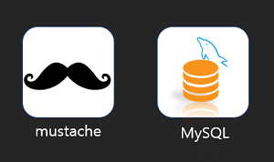
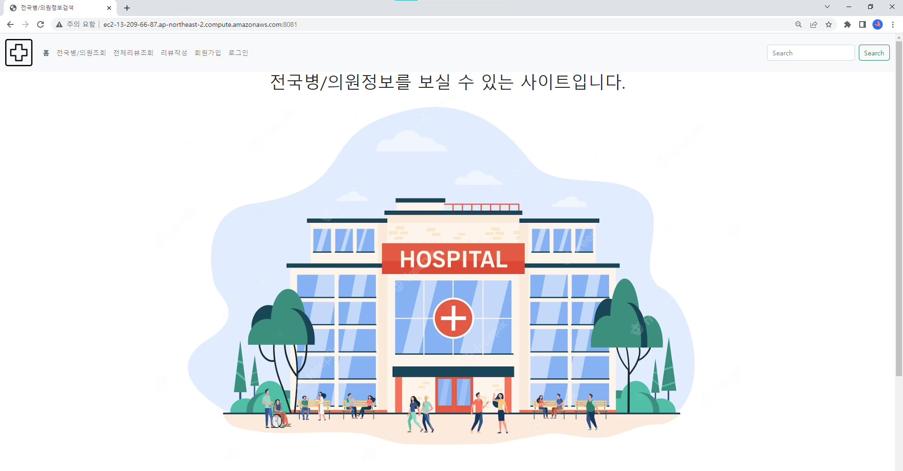
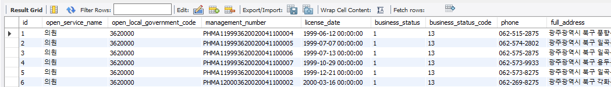
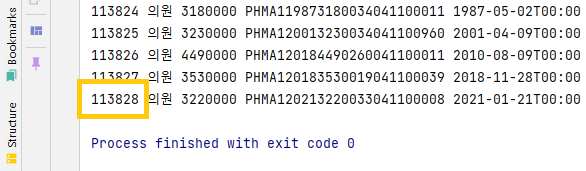
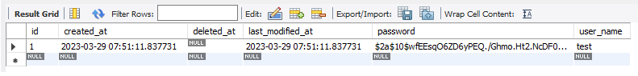
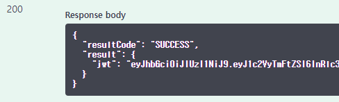
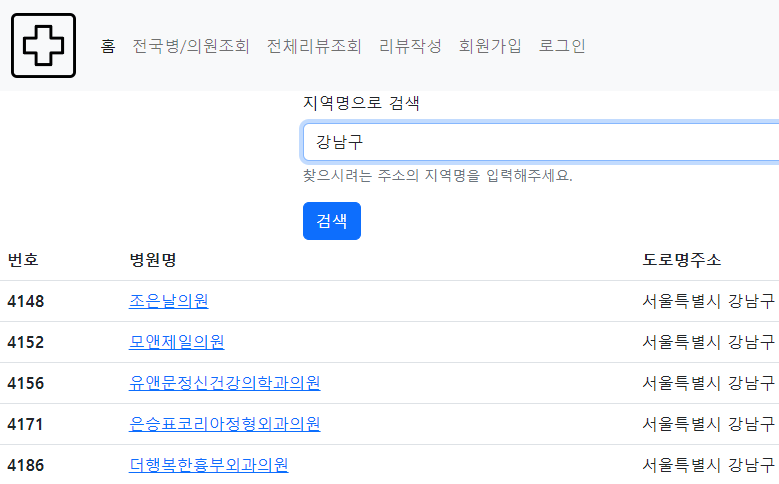

<div align="center">

    
<a href="http://ec2-52-79-111-128.ap-northeast-2.compute.amazonaws.com:8081/swagger-ui/" target="_blank"></a>    
[](http://ec2-52-79-111-128.ap-northeast-2.compute.amazonaws.com:8081/)

</div>

# 전국 병/의원 정보 사이트

> 전국 병,의원의 정보를 조회하고, 지역별로 검색할 수 있다.    
> 회원가입/로그인 기능을 사용하여 병,의원의 리뷰를 작성하고 조회할 수 있다.

## 📌 Swagger:
2023-04-10 update    
http://ec2-52-79-111-128.ap-northeast-2.compute.amazonaws.com:8081/swagger-ui/
## 📌 배포주소:
2023-04-10 update    
http://ec2-52-79-111-128.ap-northeast-2.compute.amazonaws.com:8081/    

<br>

# 개발환경
- Spring Boot 2.7.5
- Gradle 7.5.1
- Java 11
- MySQL
- AWS EC2
- Docker
- mustache

<br>

# Tech Stack
## back end

## tool

## infra

## test & database
    


# ERD

    

<br>

# Architecture


### ✅ AWS EC2
- AWS EC2 사용(Ubuntu 22.04)
  - DB 서버 / 프로젝트 배포 서버 2개 인스턴스 생성
### ✅ Dokcer
- 위에서 생성한 서버에 Docker를 설치하고 MySQL과 Spring Boot 프로젝트를 컨테이너로 실행
### ✅ Database -> mySQL
### ✅ CI / CD -> Github Actions
### ✅ Front-end -> Mustache
- Mustache + Bootstrap 사이트 페이지 구현    

    

<br>

# 구현기능
### ✅ 프로젝트 빌드
```
dependencies {
    implementation 'org.springframework.boot:spring-boot-starter-mustache'
    implementation 'org.springframework.boot:spring-boot-starter-data-jpa'
    implementation 'org.springframework.boot:spring-boot-starter-web'
    implementation 'org.springframework.boot:spring-boot-starter-security'
    implementation group: 'io.jsonwebtoken', name: 'jjwt', version: '0.9.1'
    implementation 'org.junit.jupiter:junit-jupiter:5.8.1'
    testImplementation 'org.projectlombok:lombok:1.18.22'
    compileOnly 'org.projectlombok:lombok'
    runtimeOnly 'com.mysql:mysql-connector-j'
    annotationProcessor 'org.projectlombok:lombok'
    testImplementation 'org.springframework.boot:spring-boot-starter-test'
    implementation group: 'org.springframework.security', name: 'spring-security-test'
    implementation "io.springfox:springfox-boot-starter:3.0.0"
    implementation "io.springfox:springfox-swagger-ui:3.0.0"
    implementation group: 'org.json', name: 'json', version: '20220924'
}
```
### ✅ 약 11만개의 대용량 데이터 가공
- BufferedReader
  - 대용량 데이터 파일을 읽어와 가공 후 DB insert    

    


```
public class FileController<T> {

	private Parser<T> parser;

	public FileController(Parser<T> parser) {
		this.parser = parser;
	}

	public List<T> readLine(String filename) {

		List<T> list = new ArrayList<>();

		try {
			BufferedReader br = new BufferedReader(new FileReader(filename));
			String line;

			br.readLine();
			while ((line = br.readLine()) != null) {
				try {
					list.add(parser.parser(line));
				} catch (Exception e) {
					System.out.printf("파싱 중 문제가 생겨 이 라인은 넘어갑니다. 파일내용 : %s\n", line);
				}
			}
		} catch (IOException e) {

		}
		return list;
	}
}
```
- 필요한 데이터만 추출하여 가공
```
public class HospitalParser implements Parser<Hospital>{

	public Hospital parser(String line) {
		String[] row = line.split("\",\"");

		Hospital hospital = new Hospital();

		hospital.setId(Integer.parseInt(row[0].replace("\"","")));
		hospital.setOpenServiceName(row[1]);
		hospital.setOpenLocalGovernmentCode(Integer.parseInt(row[3]));
		hospital.setManagementNumber(row[4]);

		int year = Integer.parseInt(row[5].substring(0, 4));
		int month = Integer.parseInt(row[5].substring(4, 6));
		int day = Integer.parseInt(row[5].substring(6, 8));

		hospital.setLicenseDate(LocalDateTime.of(year, month, day, 0, 0, 0));
		hospital.setBusinessStatus(Integer.parseInt(row[7]));
		hospital.setBusinessStatusCode(Integer.parseInt(row[9]));
		hospital.setPhone(row[15]);
		hospital.setFullAddress(row[18]);
		hospital.setRoadNameAddress(row[19]);
		hospital.setHospitalName(row[21]);
		hospital.setBusinessTypeName(row[25]);
		hospital.setHealthcareProviderCount(Integer.parseInt(row[29]));
		hospital.setPatientRoomCount(Integer.parseInt(row[30]));
		hospital.setTotalNumberOfBeds(Integer.parseInt(row[31]));
		hospital.setTotalAreaSize(Float.parseFloat(row[32]));

		return hospital;
	}
}
```
### ✅ 회원가입/로그인
- Spring Security + JWT
  - 회원가입/로그인/조회 기능은 인증 없이 사용할 수 있도록 `.permitAll()`
- 회원가입 시 password 는 `BCryptPasswordEncoder` 클래스를 사용하여 암호화 후 DB 저장    


- DB에 저장된 user 정보와 매칭 후 로그인 성공하면 Token 발급    



### ✅ 병/의원 조회
- Spring Data JPA 의  Pageable 사용
```
{
  "resultCode": "SUCCESS",
  "result": {
    "content": [
      {
        "id": 113828,
        "roadNameAddress": "서울특별시 강남구 논현로 848, 서경대학교 8층 (신사동)",
        "hospitalName": "압구정최안과의원"
      },
      {
        "id": 113827,
        "roadNameAddress": "인천광역시 남동구 서창남순환로 56, 3층 (서창동)",
        "hospitalName": "(의) 예현의료재단 서창세종메디컬의원"
      } 
    ],
    "pageable": {
      "sort": {
        "empty": false,
        "sorted": true,
        "unsorted": false
      },
      "offset": 0,
      "pageNumber": 0,
      "pageSize": 20,
      "paged": true,
      "unpaged": false
    },
    "totalPages": 5596,
    "totalElements": 111919,
    "last": false,
    "size": 20,
    "number": 0,
    "sort": {
      "empty": false,
      "sorted": true,
      "unsorted": false
    },
    "numberOfElements": 20,
    "first": true,
    "empty": false
  }
}
```
## ✅ 리뷰 등록, 수정, 삭제, 조회
- 원하는 병/의원에 리뷰 등록
- 작성자에 한해 수정, 삭제 가능
- 리뷰 조회는 모든 사용자 가능
- 리뷰 삭제 시 soft delete 기능을 사용
  - row를 삭제하지 않고 보관, 대신 deletedAt 필드에 삭제 된 시간을 기록

### ✅ 지역별 병/의원 조회
- 찾고자 하는 지역명을 키워드로 검색하여 조회
```
/hospitals/search?keyword=강남구
```


