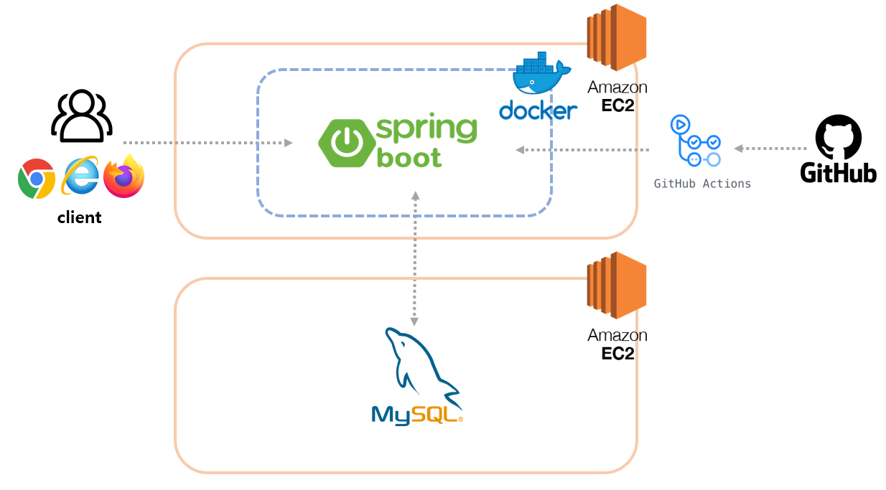

    

# 🏥 소개    
- 전국 병/의원의 병원명, 병원주소, 입원실수 등 상세 정보를 검색하여 찾을 수 있다.
- 원하는 지역명을 키워드로 검색하여 해당 지역의 병/의원만 조회할 수 있다.
- 방문한 병/의원의 리뷰를 남기고 조회할 수 있다.
- 회원가입/로그인 기능으로 리뷰를 등록/수정/삭제 할 때 보안을 지킬 수 있다.    

# ⚙ 기능
- `회원가입/로그인`
  - Spring Security를 사용하여 회원가입/로그인 기능 추가
  - 회원가입 시 userName 중복 여부 확인하여 중복일 경우 에러 처리
  - 회원가입 시 password 암호화로 DB에 저장
  - 로그인 시 userName, password가 다르면 에러 처리
- `리뷰 등록,수정,삭제,조회`
  - 등록,수정,삭제는 로그인한 회원만 가능
  - 리뷰 작성 회원만 수정,삭제 가능 아닐 경우 에러 처리
- `병/의원 조회,상세조회`
  - 로그인 없이 모든 사용자 조회가능
  - 전체 병/의원 리스트 조회
  - 원하는 병/의원을 누르면 상세 조회
- `지역별 병/의원 조회`
  - JPA 키워드 검색을 추가하여 지역별로 병/의원 조회 가능

# 📌 Tech stack
## back end

## tool

## infra

## test & database

# 📊 ERD

# 🔍 아키텍쳐

